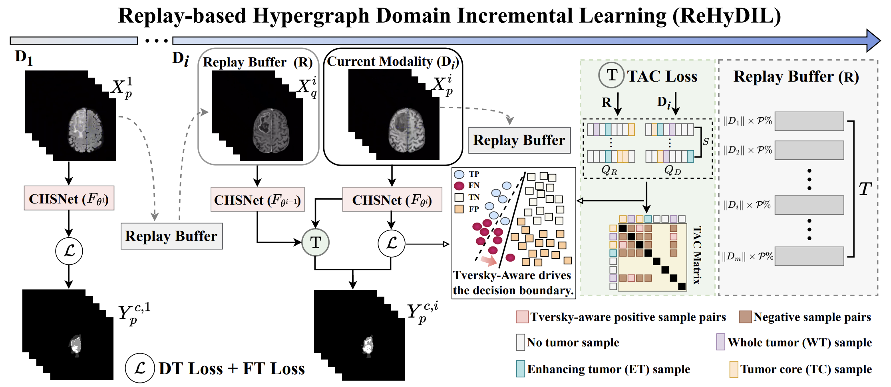

# Hypergraph Tversky-Aware Domain Incremental Learning for Brain Tumor Segmentation with Missing Modalities

* [MICCAI 2025](https://link.springer.com/chapter/10.1007/978-3-032-05141-7_28) ReHyDIL — **Re**play-based **Hy**pergraph **D**omain **I**ncremental **L**earning
  
* [Paper link](https://papers.miccai.org/miccai-2025/paper/2774_paper.pdf)



## Dataset Preparation

This work requires the **BraTS 2019 (BraTS19)** dataset. You can request access and download it from the official source:

* [**The Brain Tumor Segmentation (BraTS) Challenge**](https://www.med.upenn.edu/cbica/brats2019.html)

The script expects the data to be in a directory named ./BraTS19
```bash
./BraTS19/
├── HGG/
│   ├── BraTS19_TCIA01_.../
│   │   ├── BraTS19_TCIA01_..._flair.nii.gz
│   │   ├── BraTS19_TCIA01_..._t1.nii.gz
│   │   ├── BraTS19_TCIA01_..._t1ce.nii.gz
│   │   ├── BraTS19_TCIA01_..._t2.nii.gz
│   │   └── BraTS19_TCIA01_..._seg.nii.gz
│   └── ...
└── LGG/
    ├── BraTS19_TCIA08_.../
    │   ├── ...
    └── ...
```

## Preprocess
`pre.py` is used to convert all .nii/.nii.gz volumes to .npy format and perform the full preprocessing pipeline (e.g., orientation/spacing standardization, normalization, cropping/padding, and split generation).
```bash
python pre.py
```

Create patient-level train/val/test lists using a 80/10/10 split (patient-level) from BraTS19. Adjust paths/ratios as needed.

```bash
python pre_list.py \
  --data_root ./BraTS19 \
  --out_dir   ./lists \
  --val_ratio 0.10 \
  --test_ratio 0.10 
```

## Train

`train.py` is a stage-wise runner: it trains the model incrementally over MRI modalities.
Default configuration follows the clinical order: `t1, t2, flair, t1ce`.

If you don’t pass `--stages`, the script will run all four stages in that order.

**Quick start (full clinical sequence — default)**
The model learns its first task using only the T1 modality.
```bash
python train.py \
  --data_path /path/to/data_root \
  --out_root  /path/to/outputs \
  --train_fmt /path/lists/train.list \
  --val_fmt   /path/lists/val.list
```

## Citation
```bash
@inproceedings{wang2025hypergraph,
  title={Hypergraph tversky-aware domain incremental learning for brain tumor segmentation with missing modalities},
  author={Wang, Junze and Fan, Lei and Jing, Weipeng and Di, Donglin and Song, Yang and Liu, Sidong and Cong, Cong},
  booktitle={International Conference on Medical Image Computing and Computer-Assisted Intervention -- MICCAI 2025},
  pages={283--293},
  year={2025},
  organization={Springer}
}
```
